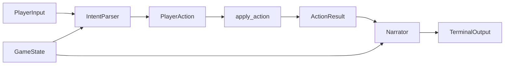

# Ollama integration plan

This document describes how Dungeon Adventure uses a local Ollama model: which model to run, how long inference typically takes, how data moves through the app, how prompts are built, and what can go wrong.

## Model choice

### Default configuration

The game reads model settings from `config.py`:

- `OLLAMA_HOST`: `http://localhost:11434`
- `OLLAMA_MODEL`: `llama3`
- `PARSER_TEMPERATURE`: `0.0`
- `NARRATOR_TEMPERATURE`: `0.7`

### Why a general local chat model

The integration needs two capabilities on every turn:

1. **Structured command parsing** into a small fixed action set (`look`, `go`, `take`, `use`, `attack`, `inventory`, `help`, `quit`).
2. **Short second-person narration** grounded in engine output, not free-form world generation.

A general instruction-following chat model is enough for v1. The Python engine owns rules, stats, combat, and win/lose logic. The model does not need tool calling, RAG, or dungeon generation.

### Recommended models

| Model | Role | Notes |
|-------|------|-------|
| `llama3` | Default in this repo | Good baseline for local demos on a machine that already has it pulled |
| `llama3.2` | Original plan default | Smaller footprint; strong fit for structured JSON parsing |
| `mistral` | Alternative | Often responsive for short structured outputs |
| `qwen2.5` | Alternative | Useful if instruction following on your hardware is stronger than other options |

Use one model for both parser and narrator in v1. Change only `OLLAMA_MODEL` in `config.py` after `ollama pull <model>`.

### Startup validation

`OllamaClient.verify()` in `llm/client.py` checks that:

1. Ollama responds at `OLLAMA_HOST`.
2. The requested model base name exists locally (`llama3` matches `llama3:latest`).

If either check fails, `main.py` exits before the game loop with a clear error.

## Inference timing

### Calls per player turn

After startup, a normal turn usually makes **two** Ollama requests:

1. **Parser** — natural language to `ParsedPlayerAction` JSON.
2. **Narrator** — `ActionResult` plus context to `NarrationResponse` JSON.

The opening `look` also uses the narrator. Parser retry adds another parser call when the first structured response fails validation.

### What affects latency

- **Cold start**: first request after Ollama starts or after a model was unloaded can take much longer while weights load.
- **Hardware**: CPU-only runs are slower than GPU-accelerated runs with enough VRAM.
- **Model size**: larger models increase load time and per-token latency.
- **Context size**: each request sends a JSON context slice and, for narration, a full action payload.
- **Temperature**: parser uses `0.0`; narrator uses `0.7`. Parser work is usually the more latency-sensitive step.

### Practical expectations

There is no in-game timer or metrics collection in v1. For demos, assume:

- **Warm runs**: often a few seconds per turn on capable hardware.
- **Cold or CPU-bound runs**: tens of seconds for the first call is possible.
- **Failure paths**: keyword fallback in `game/engine.py` avoids a parser call only when Ollama parsing throws; narration still runs unless the narrator fails and falls back to `ActionResult.message`.

For smoother demos, open the Ollama app first, run one chat message or `ollama run llama3`, then start `python main.py`.

## Data flow

### High-level loop

### Context passed to the model

`GameState.context_slice()` in `game/models.py` builds the parser and narrator context:

- Current room id, name, and description
- Exits with lock state
- Visible item ids and names
- Visible enemy ids, names, and HP
- Inventory item ids, names, and usable flag
- Player HP and game-over flags

The engine does not send the full dungeon graph every turn. Only the current room slice is included.

### Parser path

1. Player input enters `IntentParser.parse()` in `llm/parser.py`.
2. `OllamaClient.parse_with_retry()` sends system plus user messages from `llm/prompts.py` with `format=ParsedPlayerAction.model_json_schema()`.
3. Valid JSON becomes `PlayerAction` for `game/engine.py`.
4. On failure: one retry with a shorter user message, then `parse_fallback()`, then `help`.

### Engine path

`apply_action()` resolves the action deterministically and returns `ActionResult` with fields such as:

- `success`, `message`, `action`
- Room and visibility data
- Combat damage and defeat flags
- Inventory changes
- `game_over` and `outcome`

The model never mutates `GameState` directly.

### Narrator path

1. `ActionResult.to_payload()` serializes engine facts.
2. `Narrator.narrate()` sends game context and the payload with `format=NarrationResponse.model_json_schema()`.
3. The `text` field is printed in the terminal.
4. On failure, the engine `message` is shown instead.

## Prompt structure

### Parser

**System prompt** (`PARSER_SYSTEM_PROMPT` in `llm/prompts.py`):

- Lists allowed actions.
- Requires `go` to include a direction.
- Requires targets for `take`, `use`, and `attack` when the player names something.
- Restricts mapping to provided context only.
- Requires schema-shaped JSON only.

**User message**:

- `Context:` plus indented JSON from `context_slice()`
- `Player command:` plus raw input
- Instruction to return the structured action

**Retry user message**:

- Demands JSON only for the quoted command
- Defaults unclear input to `help`

**Structured output schema** (`llm/schemas.py`):

- `action`: enum
- `direction`: optional string
- `target`: optional string
- `confidence`: optional float, default `1.0`

### Narrator

**System prompt** (`NARRATOR_SYSTEM_PROMPT`):

- Second-person prose
- Only facts from the action result payload
- On failure, explain without inventing objects
- Two to four sentences
- No invented stats, items, rooms, or damage

**User message**:

- `Game context:` plus JSON context slice
- `Action result:` plus JSON from `ActionResult.to_payload()`
- Instruction to write narration

**Structured output schema**:

- `text`: string

### Hybrid boundary

Ollama may interpret phrasing and narrate outcomes. Ollama may not create rooms, items, enemies, damage, or state changes that the engine did not return. Prompts and Pydantic validation enforce that contract on the model side; the engine enforces it in code.

## Risks

| Risk | Impact | Mitigation in v1 |
|------|--------|------------------|
| Ollama not running | Game exits at startup | `verify()` with explicit host and model errors |
| Model not pulled | Game exits at startup | Error includes `ollama pull <model>` |
| Invalid parser JSON | Wrong or missing action | Retry, then keyword fallback, then `help` |
| Hallucinated narration | Story claims non-existent items or outcomes | Narrator rules, payload-only facts, fallback to engine `message` |
| Ambiguous player input | Unintended action | Low parser temperature; context slice; safe engine rejections |
| Slow turns | Poor demo experience | Warm model before play; prefer smaller local models on weak hardware |
| Single-model bottleneck | Parser and narrator share one loaded model | Acceptable for v1; split models or cache later if needed |
| No persistence | Progress lost on exit | Out of scope for v1 |
| Platform paths and shells | Setup friction on Windows vs macOS vs Linux | Documented in `setup.md` |

## Related files

- `config.py` — host, model, temperatures
- `llm/client.py` — HTTP client, structured chat, retry
- `llm/prompts.py` — prompt templates
- `llm/schemas.py` — Pydantic schemas for Ollama `format`
- `llm/parser.py` — intent parsing and fallback chain
- `llm/narrator.py` — narration and fallback
- `game/models.py` — `context_slice()`
- `game/engine.py` — authoritative rules and `parse_fallback()`
- `main.py` — startup checks and turn loop
